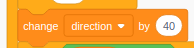

# My drawing :stuck_out_tongue_winking_eye:

### Your mission

It's simple, build an App that draws this picture:

start from this: 
{: style="max-height:250px;width:auto;height:auto;"}

to that: 
{: style="max-height:250px;width:auto;height:auto;"}

!!! warning
    You will need a bit of math skills to do this.

??? "Click to see how it's done"

    1. ### Add **Pen** blocks
    You'll need **Pen** blocks if you want to draw. Where are they?

        Click on **Add Extensions** at the bottom of the code Palatte:

        {: style="max-width:500px;width:auto;height:auto;"}

        The select **Pen**:

        {: style="max-width:500px;width:auto;height:auto;"}

    1. ### Make the background black
    The black background makes the picture look better

    1. ### Change costume to a pencil
    You may want to change your Sprite to a pencil to make it look like drawing

    1. ### Make two variables

        If you don't know what a variable is, it's ok for now. Go to **Variables** and select **Make a variable**

        {: style="max-width:500px;width:auto;height:auto;"}

        Make two variables called **direction** and **step**

        !!! tip
            Naming your variables is very important. Otherwise, how do you call it? how do you know which one is which :grimacing:

    1. ### Make the pencil draw

        {: style="max-width:500px;width:auto;height:auto;"}

        Now test your app, before moving on.

        !!! tip
            It's important to make every step work before moving on to the next

        ??? "How this works?"        
            The **repeat 100** means to repeat the insider code 100 times. We want to do it in slow motion so we can we. That's why the block **wait** is there.

            The **pen down** means pen down :grin: (draw), and **pen up** means stop drawing.

            The code inside the repeat seems to be complicated. But what it does is to change the direction of the pen **direction** and move the pen **step** steps by that direction.

        !!! tip
            Do not be afraid to try with different value for **direction** and **step**. Try to see **direction** to 40, 60, 90 or 120 like this:  to see what you got.
    
    1. ### Final touch
    **Ok, add this code before the repeat so that it won't draw over old picture all over again**

        {: style="max-width:500px;width:auto;height:auto;"}

        The block **erase all** will clear the drawing if any. The **set pen size** is used if you want different pen size. The **go to** make it start drawing from the center of the picture.

!!! challenge
    **Can you improve it one way or another?**

!!! info "This is mine"
    [https://scratch.mit.edu/projects/369374439](https://scratch.mit.edu/projects/369374439/)
