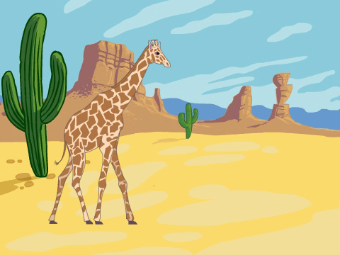
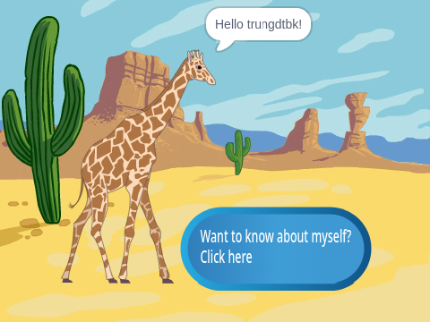
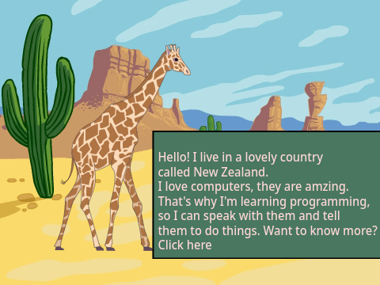
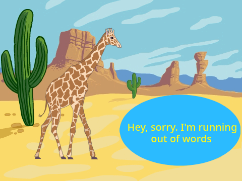
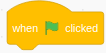
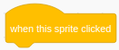
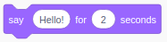
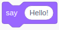
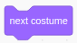

# Myself intro

In this project, we're gonna talk about ourself... (Hey, do not say anything private like your real name and school, address, phone or email, ok?)

- First stuff, write a few sentences about yourself in your Scratch profile
- Next, build a Scratch program to introduce yourself to the world :). The basic thing may look like this.

When click on Start, it goes like: say "Hello" (or even better hello by their username) and show a button to click on.

When click on the button, it shows yourself intro like:

If you have more things to say, you can add a click option to show other boxes, like this

**What can you do to improve it and make it more interesting?** 

A few easy things like change the default background, customize your Sprite or you can add like music/sounds, or animations.

# How to do?

There are many ways you can do to build this project. Can you figure it out?
Here are a few blocks you may need:

 or 

# You can take a look at how other Scratchers did

Here are some examples

- [By pigandthebarn2636](https://scratch.mit.edu/projects/73053308/editor/)
- [My Introduction! by SleepyPlays](https://scratch.mit.edu/projects/325229431/)
- [My Introduction! by Iarna1](https://scratch.mit.edu/projects/3115496/)

